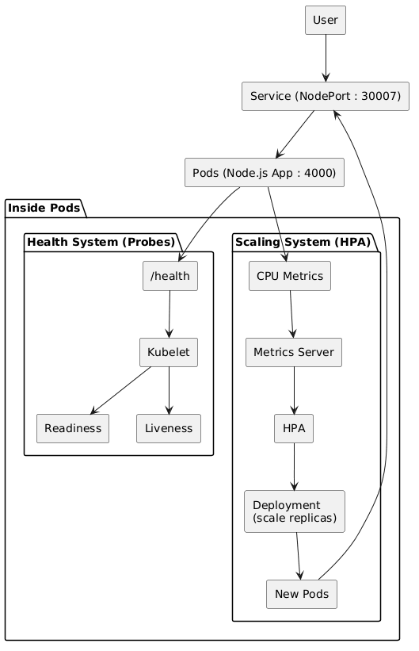
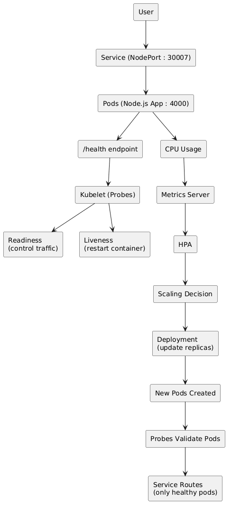
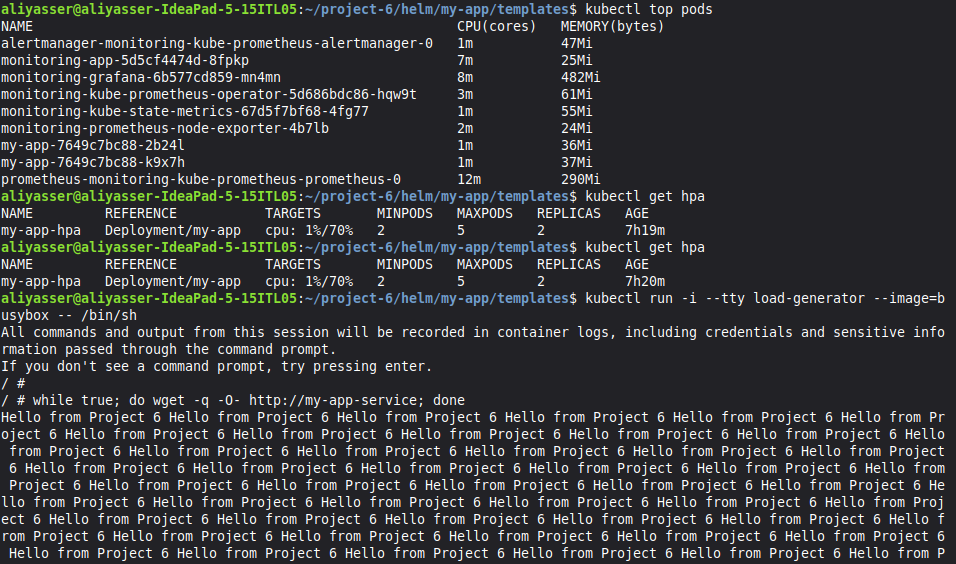
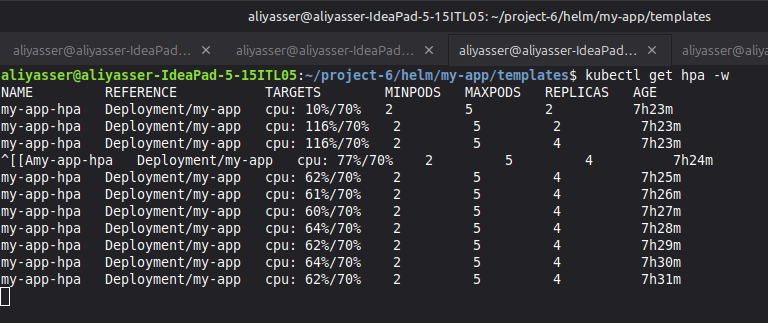
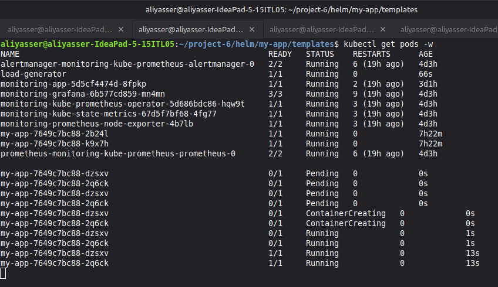
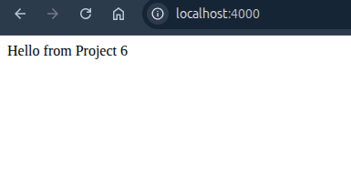

# DevOps Project 6: Kubernetes HPA Auto-Scaling System
*********************************************************
A Kubernetes-based self-healing and auto-scaling system that dynamically scales application pods using
CPU metrics while maintaining high availability through health probes.


## Overview
**************
The system combines:
- Kubernetes Deployment & Service
- Liveness & Readiness Probes
- Metrics Server
- Horizontal Pod Autoscaler (HPA)
- Helm (for configuration and templating)


### Architecture & Flow
**************************
#### System Flow

#### System Architecture



### Architecture Explanation
*******************************
The system consists of two main subsystems:

a) **Health System (Probes):**
  - Uses `/health` endpoint
  - Readiness probe controls traffic flow
  - Liveness probe ensures automatic recovery

b) **Scaling System (HPA):**
  - Collects CPU metrics via Metrics Server
  - HPA makes scaling decisions
  - Deployment updates number of replicas dynamically

Both systems work together to ensure the application is **scalable, stable, and self-healing**.


### Technologies Used
************************
- Kubernetes
- Docker
- Helm
- Node.js
- Metrics Server
- Horizontal Pod Autoscaler (HPA)


### System Demonstration
***************************

#### 1) Metrics Server (CPU Monitoring)
Provides real-time CPU usage for each pod used by HPA.


#### 2) HPA Scaling Decision
HPA detects CPU usage exceeding threshold (70%) and increases replicas.


#### 3) Pod Scaling in Action
New pods are created dynamically (Pending → Running) under load.


#### 4) Application Access
Application exposed and accessible via `localhost:4000`.


#### 5) Health Endpoint
The `/health` endpoint used by liveness and readiness probes returns `200 OK`.


### Key Concepts
*******************
#### Health Probes
- **Readiness Probe** → controls when pod receives traffic  
- **Liveness Probe** → restarts container if unhealthy  

### Auto Scaling
- HPA monitors CPU via Metrics Server  
- Scales pods between min and max replicas  
- Ensures reliable performance and availability under varying load conditions 

### Helm
- Separates configuration from logic  
- `values.yaml` → controls behavior  
- Templates → define system structure  


### Key Concepts & Learnings
*******************************
- Built a system combining **auto-scaling (HPA)** and **self-healing (probes)**  
- Understood Kubernetes **feedback loop**: metrics → decision → scaling  
- The difference between **liveness** and **readiness probes** and their role in system stability  
- Designed a `/health` endpoint for automated health monitoring  
- Used **Metrics Server + HPA** for dynamic CPU-based scaling  
- Learned how to separate **configuration (Helm values)** from **infrastructure logic**
- Observed real system behavior under load (pods scaling dynamically)  
- Ensured high availability by routing traffic only to **ready pods**


### How to Run
*****************
```bash
### Start minikube
minikube start

### Enable metrics server
minikube addons enable metrics-server

### Deploy using Helm
cd helm/my-app
helm install my-app .

### Check pods
kubectl get pods

### Check HPA
kubectl get hpa

### Generate load
kubectl run -i --tty load-generator --image=busybox -- /bin/sh

### Inside pod
while true; do wget -q -O- http://my-app-service; done
```

## Author
Ali Yasser
