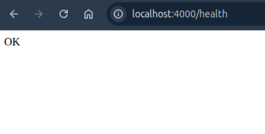

# DevOps Project 6: Kubernetes HPA Auto-Scaling System
*********************************************************
This project demonstrates a Kubernetes-based system that automatically scales application pods based on
CPU usage while ensuring system stability using health probes.

## Overview
**************
The system combines:
- Kubernetes Deployment & Service
- Liveness & Readiness Probes
- Metrics Server
- Horizontal Pod Autoscaler (HPA)
- Helm (for configuration and templating)

### Architecture & Flow
**************************
#### System Flow

#### System Architecture


### Technologies Used
************************
- Kubernetes
- Docker
- Helm
- Node.js
- Metrics Server
- Horizontal Pod Autoscaler (HPA)


### System Demonstration

#### 1) Metrics Server (CPU Monitoring)


Provides real-time CPU usage for each pod used by HPA.


#### 2) HPA Scaling Decision


HPA detects CPU usage exceeding threshold (70%) and increases replicas.


#### 3) Pod Scaling in Action


New pods are created dynamically (Pending → Running) under load.


#### 4) Application Access


Application exposed and accessible via `localhost:4000`.


#### 5) Health Endpoint



The `/health` endpoint used by liveness and readiness probes returns `200 OK`.


### Key Concepts

#### 🔹 Health Probes

- **Readiness Probe** → controls when pod receives traffic  
- **Liveness Probe** → restarts container if unhealthy  

---

### 🔹 Auto Scaling

- HPA monitors CPU via Metrics Server  
- Scales pods between min and max replicas  
- Ensures system stability under load  

---

### 🔹 Helm

- Separates configuration from logic  
- `values.yaml` → controls behavior  
- Templates → define system structure  

---

## ▶️ How to Run

```bash
# Start minikube
minikube start

# Enable metrics server
minikube addons enable metrics-server

# Deploy using Helm
cd helm/my-app
helm install my-app .

# Check pods
kubectl get pods

# Check HPA
kubectl get hpa

# Generate load
kubectl run -i --tty load-generator --image=busybox -- /bin/sh

# Inside pod
while true; do wget -q -O- http://my-app-service; done

